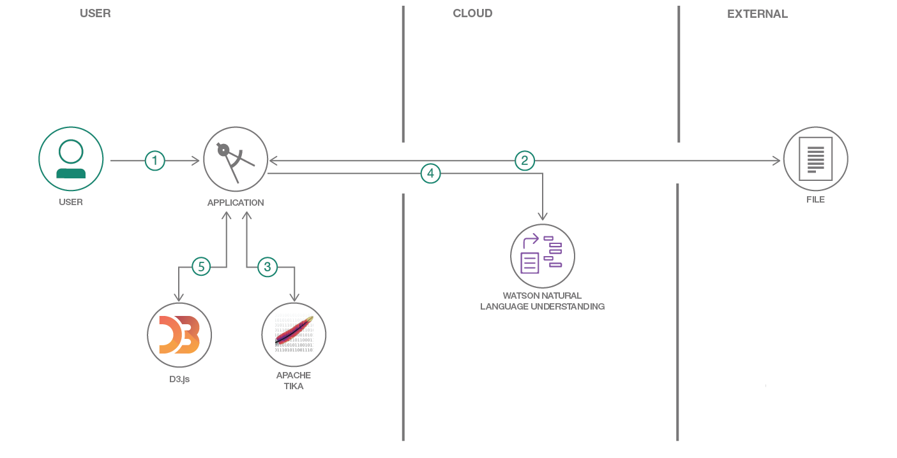

[](https://travis-ci.org/IBM/visualize-unstructured-content-with-watson)

!!! WORK IN PROGRESS !!!

# Visualize Unstructured Content Using Watson Natural Language Understanding

Spring Boot app which allows user to upload a file and see Watson NLU results for that document in a bubble cloud.

Configure your Watson NLU username and password in NLUCredentials.java.

App uses Apache Tika to extract text from documents. https://tika.apache.org/1.16/formats.html

Excellent resource on bubble cloud by Jim Vallandingham here: http://vallandingham.me/building_a_bubble_cloud.html

In this Code Pattern, we will [create something] using [technologies] and [components]. [Explain briefly how things work]. [Give acknowledgements to others if necessary]

When the reader has completed this Code Pattern, they will understand how to:

* [goal 1]
* [goal 2]
* [goal 3]
* [goal 4]



## Flow

1. User configures credentials for the Watson NLU service and starts the app.
2. User selects document file to proecess and load.
3. Document text is extracted using Apache Tika.
4. Extracted data is passed to Watson NLU for enrichment.
5. Enriched data is visualized in the UI using the D3.js library.

# Watch the Video

!!! COMING 

# Steps

1. [Clone the repo](#1-clone-the-repo)
2. [Create Watson services with IBM Cloud](#2-create-watson-services-with-ibm-cloud)
3. [Configure credentials](#3-configure-credentials)
4. [Run the application](#4-run-the-application)

### 1. Clone the repo

Clone the `watson-banking-chatbot` locally. In a terminal, run:

```
$ git clone https://github.com/IBM/visualize-unstructured-content-with-watson
```

### 2. Create Watson services with IBM Cloud

Create the following services:

* [**Watson Natural Language Understanding**](https://console.ng.bluemix.net/catalog/services/natural-language-understanding)

### 5. Configure credentials

The credentials for IBM Cloud services, can be found in the ``Services`` menu in IBM Cloud, by selecting the ``Service Credentials`` option for each service.

Copy the [`env.sample`](env.sample) to `.env`.

```
$ cp env.sample .env
```
Edit the `.env` file with the necessary settings.

#### `env.sample:`

```
# Replace the credentials here with your own.
# Rename this file to .env before starting the app.

# Watson Natural Language Understanding
NATURAL_LANGUAGE_UNDERSTANDING_USERNAME=<add_nlu_username>
NATURAL_LANGUAGE_UNDERSTANDING_PASSWORD=<add_nlu_password>
```

### 6. Run the application

1. Build and package the Java app by running the following Maven command:

```
mvn clean package
```

> Note: if you do not already have Maven installed and configured locally, you can substitute the `mvn` portion of the command with either `./mvnw` (on Linux or Mac), or `mvnw.cmd` (on Windows). This will run a version of Maven that has been setup for only this github repo.

2. Start the app by running:

```
java -jar target/nlu-visual-1.0.jar
``` 

3. Browse to `http://localhost:8080` to see the app.

4. To start the visualization process, select and upload a document from your local file system. The file can be in `.doc`, `.docx`, `.txt`, or `.pdf` format. For your convenience, we have included 2 sample poems located in the [data](/data) subdirectory of this repo. 

# Sample output


# Troubleshooting

* Error: Environment {GUID} is still not active, retry once status is active

  > This is common during the first run. The app tries to start before the Discovery
environment is fully created. Allow a minute or two to pass. The environment should
be usable on restart. If you used `Deploy to IBM Cloud` the restart should be automatic.

## License

This code pattern is licensed under the Apache License, Version 2. Separate third-party code objects invoked within this code pattern are licensed by their respective providers pursuant to their own separate licenses. Contributions are subject to the [Developer Certificate of Origin, Version 1.1](https://developercertificate.org/) and the [Apache License, Version 2](http://www.apache.org/licenses/LICENSE-2.0.txt).

[Apache License FAQ](http://www.apache.org/foundation/license-faq.html#WhatDoesItMEAN)